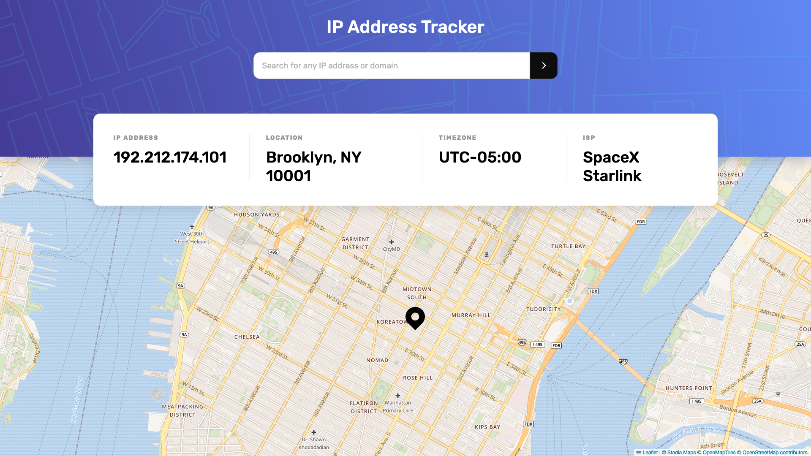

# IP Address Tracker

A front-end application that displays network information and visually pinpoints the location on a map.

## Table of contents

- [Overview](#overview)
  - [The challenge](#the-challenge)
  - [Screenshot](#screenshot)
  - [Links](#links)
- [My process](#my-process)
  - [Built with](#built-with)
- [Acknowledgments](#acknowledgments)

## Overview

### The challenge

Users should be able to:

- View the optimal layout for each page depending on their device's screen size
- See hover states for all interactive elements on the page
- See their own IP address on the map on the initial page load
- Search for any IP addresses or domains and see the key information and location

### Screenshot

### Links

- [Solution](https://github.com/grenzk/ip-address-tracker)
- [Live Site](https://ip-address-tracker-eight-neon.vercel.app/)

## My process

### Built with

- Semantic HTML5 markup
- CSS custom properties
- Flexbox
- Mobile-first workflow
- SASS
- Vue
- PrimeVue
- Vue Leaflet
- IP Geolocation API by IPify

## Acknowledgments

This project was inspired by the [IP address tracker challenge on Frontend Mentor](https://www.frontendmentor.io/challenges/ip-address-tracker-I8-0yYAH0). Frontend Mentor challenges provide valuable opportunities to enhance coding skills by working on realistic projects.
